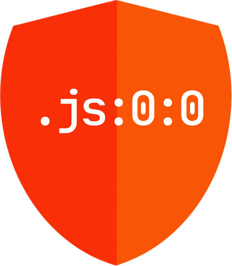

  

# @error-handlers

[ErrorHandler](https://angular.io/api/core/ErrorHandler) implementation for [Angular](https://github.com/angular/angular) for the multiple definition of error hooks

## Packages

- [@error-handlers/core](./libs/core) - module and service for configuring
- [@error-handlers/sentry](./libs/sentry) - module and service for reporting to [Sentry](https://sentry.io/)
- [@error-handlers/sentry/server](./libs/sentry/server) - SSR module for reporting to [Sentry](https://sentry.io/)
